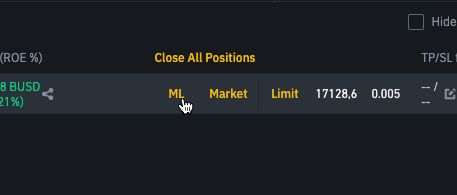

## This is information, not financial advice or recommendation!!!
I'm not responsible for any damages caused by this extension. Use it at your own risk.

# BINANCE-MARKET-LIMIT
 \

Quickly close position using limit order with current price without manually entering current price into limit input field. \
Sometimes when slippage is really high I don't think I can trust 
``purchase or sell a financial asset instantly at the best price currently available.``, \
so I created following extension to experiment with it.
